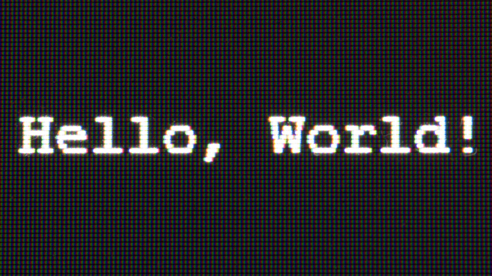
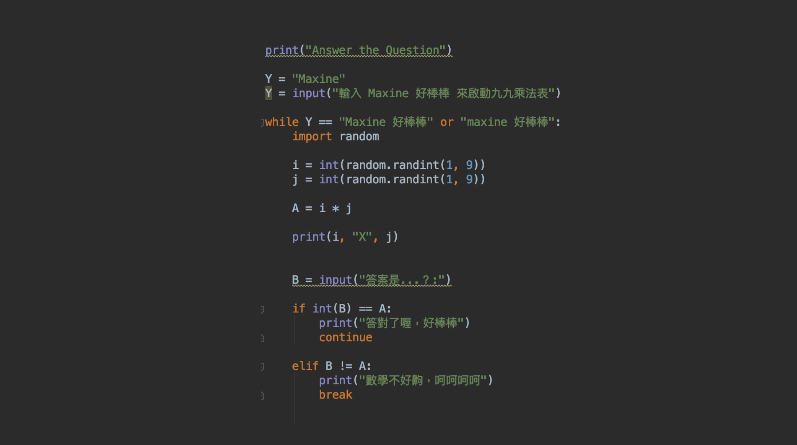

---

# Hello World，寫給教程式的人：print("誰是初學者？")
#### 為什麼「你要用程式做什麼？」可能不是個適合初學者的提問

（來源：Dwayne Bent；CC BY-SA 2.0）

> 我知道我要做什麼了。
> 平常看新聞都要自己去找，或用 RSS 什麼的，乾脆用關鍵字跟字串讓我要的新聞內容自己導進我的網站好了。

我是三創育成的編輯，百分百人文萃取的文科生，平常寫一些與科技議題相關的文章，也採訪工程師，偶爾協助課程的籌備與執行，但我不會寫扣。前陣子，抱著肥水不落外人田的心態（歐巴桑心態），我報名了由我們自己與 Taiwan Code School 合辦的「輕鬆上手 Python 程式語言」。

透過在這三晚的課，我得出了兩個學習心得與觀察：一是過去多次旁聽技術課程，這次身體力行，角色從協助籌辦課程的工作人員，變成底下實作上課的學員。我發現，「教程式的人」與「被教程式的人」之間有條無形的鴻溝。這條溝，需要雙方，甚至第三方（例如我們這樣的開課單位）來回溝通才能填補。
 
於是，我寫下這篇文章，寫給老師（工程師）與開辦授課的那一方：初學者在想什麼？初學者在怕什麼？更重要的是，誰是初學者？

### 誰是初學者？

「誰是初學者」不是個容易回答的問題。一種米養百樣人，初學者也是百種樣態。從前端轉後端的，是後端的初學者；從 JavaScript 轉 Python 的，是 Python 的初學者；從 PM 轉學程式的，是程式初學者；會 Python 但要學機器學習的，是機器學習的初學者；電腦一當機就不知所措哭找 IT 部門，現在卻要開始學習非人類自然語言的人（像我這種），更是所謂的「程式麻瓜」初學者。
 
> 你的學生，是屬於哪類的初學者呢？
 
 
前陣子育成團隊內部進行課程設計回顧。過去我們提供相當多以「零基礎」及「自學」為主軸的技術課程，希望能逐步引導學員找到自己的學習定位。但後來發現，我們對「零基礎」的定義相當模糊且曖昧。也就是說，我們沒有掌握住來參加課程的「初學者」的真實樣貌。
 
舉例來說，幾週前我旁聽了一場機器學習的零基礎課程。聽著聽著才發現，來上課的學員可能需要對 Python 或統計學稍有認識，才比較能跟上進度，或正確理解老師所講的，不然所學只會「過眼雲煙」。儘管老師教得確實不難，但如果學生本身不具備某些基本條件，例如對程式語言、Python、統計學的基礎認知，要在短短幾小時內快速融入，則會有一定挑戰，也很容易因聽不懂而迷路。
 
另一個例子來自那三天的 Python 課程。
 
與我一起上課的學員中，有像我這樣一輩子都沒寫過「電腦語言」、對電腦世界甚至相當陌生的「零基礎」，也有熟稔其他程式語言，只是沒寫過 Python 的「零基礎」（對方還是小六生呢，真汗顏…）。
 
如此看來，我這種「初學」與小六生的「初學」，基礎點上顯然就有差異。我需要更傻瓜式的教學方法；而他必定比我更了解程式語言廣義而言的運作邏輯。這些差異，都成為我們推廣課程、設計課程，以及與講師溝通內容時，需要深思熟慮的細節。
「你要用程式做什麼？」這是好問句嗎？
這應該是所有想學程式語言的人最常碰到的問句；大概也是所有工程師在被想學程式的朋友問到煩時，最常反問的。
 
先畫靶再射箭的方式，有助於引導初學者進一步思考「為何而學」。除了能檢視自己是否有足夠的動機跟目標，對於學習流程的規劃，也有如指北針，有明確可依循的步驟，免去繞路找不到學習定位的窘境。
 
只是，人生如果這麼容易找到指北針，大家就不會我廢我驕傲了。這世界上就是有像我這種說餓了想吃飯，但要吃什麼？

> A：不知道。
> B：吃拉麵（寫網頁）？
> A：不要。
> B：吃炸雞（寫 APP）？
> A：不要。
> B：吃滷肉飯？（寫遊戲）？
> A：不要。
B：那你要吃什麼？
A：吃飯。（寫程式）
B：…
A：（我才想點點點好嗎，為什麼騷不中我的癢呢！！）

我在網路上找過各種初學者的心得分享，其中一位作者的悲鳴，讓人看了心有戚戚焉。她說當她詢問工程師友人如何學寫程式時，被問的第一個問題都是「你要用程式做什麼？」，她吶喊：

> 「我根本不知道有哪些選項可以選擇啊！」
> 

許多初學者並不清楚程式語言的原理、邏輯跟應用的場景。就算網路上看過很多文章，但沒有看過 demo、沒有實作體驗，其實很難光靠腦袋「想」出程式語言可以「做」什麼。對我們而言，「我可以拿程式來做什麼」是個非常抽象的問句。
 
工程師與老師們因為成日與程式為伍，經年累月，腦海中已建構出一個「資料庫」，信手拈來，就能輕鬆勾勒出許多應用場景的畫面。但初學者的腦袋裡卻沒有這麼清楚及完整的資料庫。所以當被問及「你要拿程式做什麼」時，腦中跑出的可能是更多的問句：

大家口中的「專案」是什麼？它聽起來是個很專業、有一定規模且有明確藍圖的東西。架個人網頁也算是專案嗎？那我要什麼樣的網頁（或網站）呢？它需要什麼樣的規模跟需求？對應到什麼程式語言？我要怎麼判斷哪個語言最適合拿來寫出我要的功能？

也許有些人會說，這就是學生要自己回去做功課的啊。但事實是，作為初學者心中都有很多疑問跟不確定。提問容易，卻未必有能力解答。更可怕的是，我甚至不確定我的提問是不是「太笨」了？我也會擔心，當我問出這麼笨的問題時，對方會不會覺得我都不做功課？
 
以上笨笨的提問、糾結的內心、鬼打牆的問句，每一個點，都足以讓對程式有點興趣、有點動力，但尚不知該如何「定錨」的初心者卡關許久。
而這條「定錨」之路，往往才是跨領域初心者在開始上課或採取自學前，最需要有經驗者從旁引導的。
 
此外，根據以往碰過一些對語言程式的描述，常常是「簡潔」、「優雅」、「快速」、「易學」、「容易除錯」等形容詞。這些描述在沒有應用場景的輔助下，對非相關領域的學習者而言，就算是中文，也如天書般難以領悟。

 *如何「定錨」，是跨領域初心者在開始上課或採取自學前，最需要有經驗者從旁引導的。（來源：Yoann Gauthier；CC BY-NC 2.0）*

### 「為什麼你上完課後就知道要做什麼了？」

文章一開頭有說，我在第二天晚上「腦洞大開」，之前一直不清楚學 Python 要拿來做什麼（只有很模糊的概念），突然間有了很清楚的應用場景：我要讓電腦固定幫我抓與彙整我要的新聞跟資料，而我的網站就會像一個儀表板（dashboard）一樣，固定有即時更新的訊息。如此一來，我就不用再去 RSS、Twitter、新聞網站一個個滑了！
 
我很興奮的把這個點子告訴了我們三創育成具資深開發經驗 EIR（駐點創業家）林宜儒（以下簡稱 L），他卻顯得困惑： 

> 「為什麼妳上完課後就知道要做什麼了？」
> 
他的困惑其來有自。過去一年因為工作關係，我無數次被他推坑學寫程式、被慫恿架設自己的部落格、寫網頁。可是除了妥協開 GitHub 帳號外，我卻一路裝死。後來發現有兩個核心原因：（一）我不知道程式語言在做什麼；（二）我不知道我可以用程式語言做什麼。
 
這兩個核心問題，可能是許多初學者在正式接觸程式語言之前，遲遲裹足不前、望之卻步的原因；這兩個問題，亦是許多開班授課的工程師老師們，積極協助學生跨越的障礙。
 
理論上來說，我應該不會不知道程式語言是用來幹嘛的。從過去採訪的工程師，到筆下介紹的產品及公司，每一個故事皆因程式語言而生，就像矽谷創投大老 Marc Andreessen 所說的，軟體吃了這個世界。
 
只是，我並不真的知道程式語言怎麼運作，而且無法對應到個人需求，腦袋也無法想到應用場景。
 
一般而言，我們體驗到程式語言帶來的益處時都已經是結果、是成品了，例如手上一款有漂亮介面的 APP、一個互動體驗順暢的網站。但這中間，從零（程式碼階段）到生出成品的過程，涉及更多繁瑣的步驟，比方說為了回應使用者要求而開發的新功能等。這些也都是程式語言所發揮的應用場景；但對許多非相關領域的人來說，這些「應用場景」不只很難具體想像的，也很難想像該如何被落實與執行。
 
就像人人都能喊出「我要蓋房子」，卻未必知道該如何選擇建材、進行丈量、繪製設計圖或進行管線維護等。
 
回歸到個人，就算我可以在採訪中告訴讀者受訪者的產品是用什麼程式語言寫的，其中的功能又用了使用什麼技術，我還是不知道自己寫程式要幹嘛。我要用它來「具體」做出些什麼？我似乎沒有非得需要程式來解決的事（也或許是有，但我不知道可以用程式來解決）。

### 崩潰，我卡在 Input

上述那些如鬼打牆的糾結，都是因為程式乃至整個電腦世界對我來說都太陌生了。我就像是在漆黑的尖叫屋裡，只敢緊貼著牆壁摸著走。
 
第一天上課，因為 PyCharm 出現了 bug，大約有五分多鐘的時間助教在協助我排除障礙，我因此漏聽了一段。當回過神，黑壓壓的程式碼中多了一個從未見過的符號 - - input（使用者輸入）。
 
看著老師 demo 的範例，我隱約知道是要讓某個接收訊息者「輸入」某些訊息，來作回應。但我不知道為什麼需要 input、為什麼需要某個接收訊息者「輸入」訊息。我開始感到慌張（當我現在搞懂回頭看時，自己也不太清楚當初為何能會這般大卡關 XD）。
 
這股慌張持續到第二天我們開始上「迴圈」。我因為一直糾結在不理解為什麼這個環節需要出現 input，導致整堂課都像牙縫卡了菜一樣，不影響咀嚼，但就覺得卡著難受。而且覺得不解開，一定會讓接下來的問題毛線球越滾越大。

*現在當然是理解了 input 了啦（來源：上課筆記）*

下課後抱持著可能被笑說 input 就是等待輸入啊，有什麼好糾結的風險，我終於向外求救了：

> 我：「我不理解為什麼要寫 input() 。
今天上迴圈，都聽得懂，但操作加入 input 我整個就看不懂。」
L：「等待輸入嗎？』
我：「對啊，但為什麼要做「等待輸入」這件事？」
L：「因為電腦要等你告訴他下一步要做什麼呀。
    例如你要登入，
    電腦等待使用者輸入密碼，
    所以要 input username & password。」
    
登愣！直到這一刻起，我才終於知道，我使用程式語言是在跟電腦說話！！
 

笑我吧。人類語言是跟人類溝通，程式語言當然是跟電腦溝通啊！聽起來是很簡單的邏輯吧？但我以前的生活環境裡面又不需要跟電腦講話，input 當然不在我的字典裡啊，也當然就不是這麼理所當然的事。我怎麼知道在跟另一個人類（使用者）說話前，還需要先跟電腦說話，再讓電腦跟他（使用者）說話……。（自暴自棄）
 
這個小插曲讓我意識到，學程式不只是學語法而已，而是要拋掉人類溝通的思維，去熟悉電腦的「語感」、去進到電腦語言的脈絡。
 

這個例子也凸顯出我與那位會其他程式語言只是不會 Python 的小六生，在「零基礎」上的差異；同時，也是我與老師們認定的「基礎」有所差異的地方。來自不同背景的大家各自在地圖上不同的座標上，要怎麼往共同目標（學會 Python）前進，就是教學上的一大考驗。
 
 
當然，「輕鬆上手 Python 」的 Louis 老師，他的教學特色就是以超級淺顯易動、生動且傻瓜式的方法來帶學生進入程式語言的世界。他教的速度不會太快，對第一次觸碰程式語言的人來說，是個很好跟上的節奏。 Louis 老師講話速度也不會太快（我一度以為他太累想睡覺），且會頻繁停頓、詢問學生是否有跟上。這點相當重要，因爲小時候上電腦課最大的噩夢，就是老師自認為已經講得很簡單，學生「應該聽懂、應該跟得上」，所以加快速度，爲趕進度而教。
 
 
這次參加三個晚上的衝刺班，原本只打算以學員的身份專心學寫程式，未料忍不住以協辦課程一員的身份，在課堂中觀察與思考我們可以如何優化未來的課程規劃與設計。

如果你是初學者，也有想對所有程式語言老師的「吶喊」（或悲鳴），請不吝嗇留言給我們，讓我們與老師們有機會打造更貼近你需求的學習環境。

